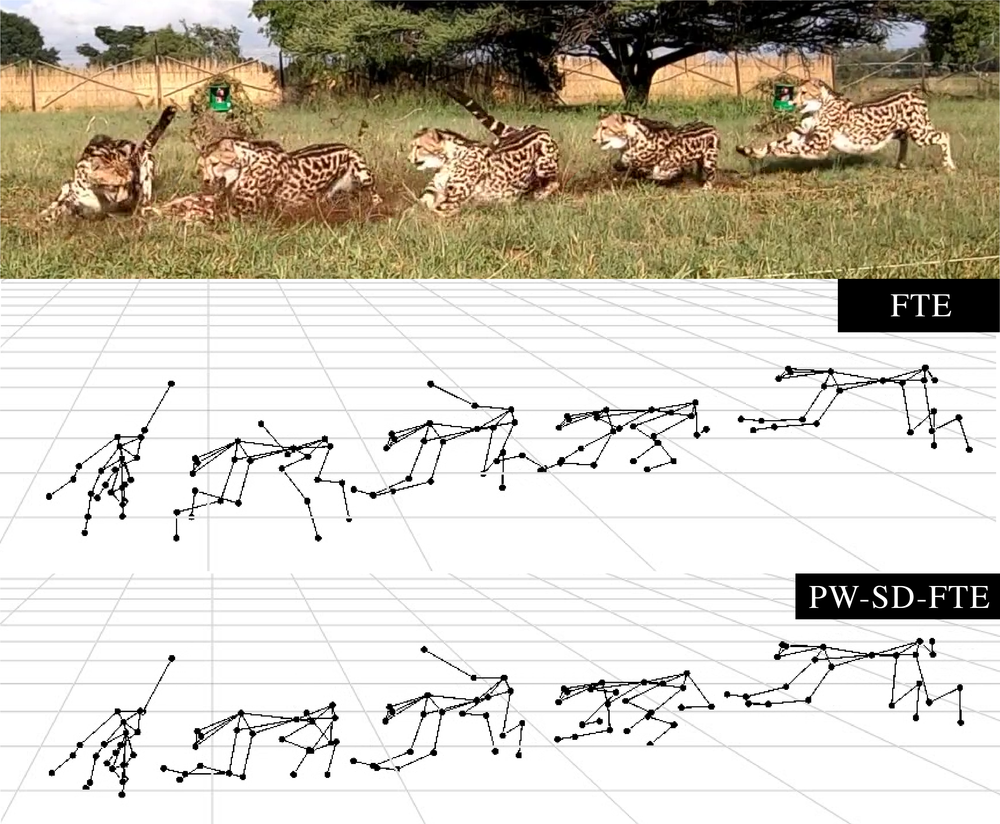
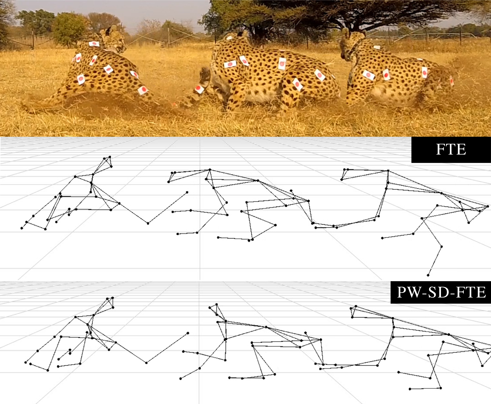

# Improving 3D Pose Estimation of Cheetahs in the Wild

We identified issues on our previous 3D pose estimation (FTE) baseline in AcinoSet. This work aims to solve two of them: unnatural pose estimates during highly occluded sequences and synchronisation error between multi-view data.

We provide two new methods to resolve these issues; PW-FTE and SD-FTE. The PW-FTE expands on image-dependent pairwise terms, produced from a CNN, to infer occluded 2D keypoints, while SD-FTE uses shutter delay estimation to correct the synchronisation error. We combined the two methods into PW-SD-FTE, that produces the most accurate 3D pose estimation on AcinoSet.

For more information please read our paper on the topic: [TODO](#)

### Getting started
If you want to obtain metrics for each method, download the 2D hand labelled [ground truth](https://www.dropbox.com/sh/r0b1a086wl7dqkv/AAD5zBQ-nSiTS5Dc2QqTd_ZDa?dl=0) data.

There is a simple [jupyter notebook](/src/pw_sd_fte.ipynb) to get started with running the code. The `pw_sd_fte.py` module exposes three main functions - `run`, `metrics`, `acinoset_comparison`.  Refer to the docstrings on how to interact with the API.

### Pairwise pseudo-measurement graph
In this work, we decided to only generate PPMs from “intuitive” pairwise terms, i.e. infer the  location  of  a  keypoint  that  makes  kinematic  sense  with regard to the cheetah skeleton. The table below provides the base keypoint and it's corresponding PPMs.

Base keypoint           | Pairwise term 1           |  Pairwise term 2
:-------------------------:|:-------------------------:|:-------------------------:
r\_eye | nose | l\_eye
l\_eye | nose | r\_eye
nose | r\_eye | l\_eye
neck\_base | spine | nose
spine | neck\_base | tail\_base
tail\_base | spine | tail1
tail1 | spine | tail\_base
tail2 | tail1 | tail\_base
l\_shoulder | l\_front\_knee | neck\_base
l\_front\_knee | l\_shoulder | l\_front\_ankle
l\_front\_ankle | l\_front\_knee | l\_shoulder
l\_front\_paw | l\_front\_knee | l\_front\_ankle
r\_shoulder | r\_front\_knee | neck\_base
r\_front\_knee | r\_shoulder | r\_front\_ankle
r\_front\_ankle | r\_front\_knee | r\_shoulder
r\_front\_paw | r\_front\_knee | r\_front\_ankle
l\_hip | l\_back\_knee | tail\_base
l\_back\_knee | l\_hip | l\_back\_ankle
l\_back\_ankle | l\_back\_knee | l\_hip
l\_back\_paw | l\_back\_knee | l\_back\_ankle
r\_hip | r\_back\_knee | tail\_base
r\_back\_knee | r\_hip | r\_back\_ankle
r\_back\_ankle | r\_back\_knee | r\_hip
r\_back\_paw | r\_back\_knee | r\_back\_ankle

### Qualitative results

2019\_03\_09/jules/flick2          | 2017\_08\_29/top/phantom/flick1\_1           |  Frame Examples
:-------------------------:|:-------------------------:|:-------------------------:
 |  | 
